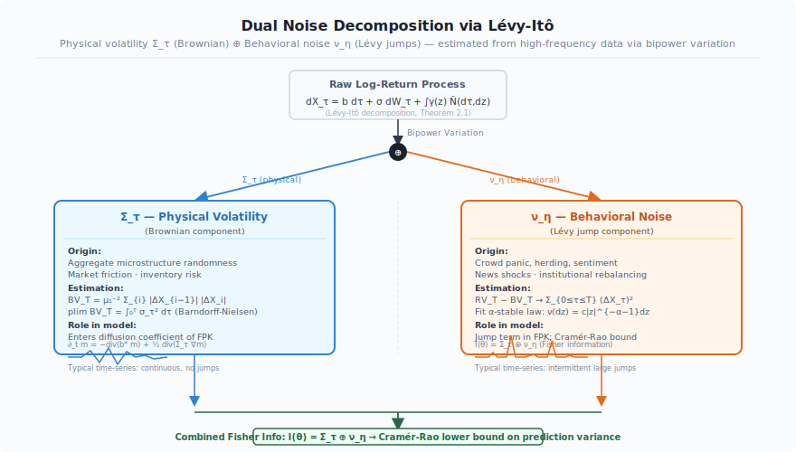

# A Mathematical Theory of Market World Models

**Hierarchical Mean-Field Dynamics, Dual Stochastic Decomposition, and Financial Event Operator Algebras**

> **Author:** HongJin HE (何泓锦) · HKUST + Stanford IHP · July 2026  
> **Status:** Preprint — submitted to arXiv:q-fin.MF  
> **Target journal:** Mathematical Finance / SIAM Journal on Financial Mathematics  
> **MSC 2020:** 91G99, 60G51, 49N80, 22A22, 60H10

---

## Abstract

We develop a rigorous mathematical theory for *market world models* — probabilistic dynamical systems that learn and simulate the full evolutionary law of financial markets, rather than extracting statistical correlations through factor models. The framework rests on five interlocking contributions:

**(i) Dual Stochastic Decomposition.** We prove that market noise admits a canonical Lévy–Itô decomposition into two orthogonal components: *physical noise* driven by a Brownian motion (fundamental information uncertainty) and *behavioral noise* driven by a pure-jump Lévy process (sentiment and herding effects). We derive a Cramér–Rao-type lower bound showing that prediction variance is bounded below by a sum of two irreducible terms — a market-structure analogue of the Heisenberg uncertainty principle.

**(ii) Financial Event Operator Algebra.** Every corporate or macroeconomic event (IPO, merger, interest rate shock) is modeled as an affine operator on the market state space. We classify all such operators by their algebraic mode and prove that the full event algebra carries the structure of a *topological groupoid* — a generalization required because mergers and spin-offs alter the dimension of the state space.

**(iii) Hierarchical Mean-Field Theory.** Real markets exhibit simultaneous MFG and MFC structures at different scales. We formulate a two-level McKean–Vlasov system and prove existence and uniqueness of a *hierarchical Nash equilibrium* under Lipschitz, boundedness, and Lasry–Lions monotonicity conditions.

**(iv) Stochastic Lyapunov Stability.** Using Lyapunov methods for combined Brownian-Lévy systems, we prove that the market world model admits a unique invariant measure with sharp exponential convergence rates. Bubbles and crises correspond precisely to local violations of the Lyapunov condition.

**(v) E-Game-C Implementation Pathway.** We derive a concrete computational realization: bipower-variation calibration (Stage 1); Transformer VAE Encoder with predictive coupling (Stage 2); Deep Galerkin Method solver for HJB + neural fictitious play for Fokker–Planck (Stage 3); gradient-based Controller with risk constraints (Stage 4).

**Keywords:** world model, mean-field game, stochastic differential equation, Lévy process, groupoid, Lyapunov stability, market microstructure, prediction lower bound.

---

## Architecture Overview

### Figure 1 — E-Game-C World Model Architecture


The three modules implement the paper's five contributions sequentially: the Encoder performs Lévy-Itô decomposition and bipower-variation calibration; the Game module solves the HJB+FPK system via DGM and neural fictitious play; the Controller applies Stochastic Lyapunov stability analysis and enforces the Cramér-Rao prediction floor.

### Figure 2 — Dual Noise Decomposition



The Lévy-Itô theorem guarantees that any semimartingale decomposes into a continuous (Brownian) component Σ_τ and a pure-jump component ν_η. These are estimated from high-frequency data via bipower variation: BV_T converges to the integrated physical variance, and RV_T − BV_T isolates the jump quadratic variation.

---

## Table of Contents

1. [Probabilistic Foundations](#1-probabilistic-foundations)
2. [World Model as an Optimal Estimation Problem](#2-world-model-as-an-optimal-estimation-problem)
3. [Dual Stochastic Decomposition](#3-dual-stochastic-decomposition)
4. [Financial Event Operator Algebra](#4-financial-event-operator-algebra)
5. [The E-Game-C Architecture](#5-the-e-game-c-architecture)
6. [Hierarchical Mean-Field Theory](#6-hierarchical-mean-field-theory)
7. [Stochastic Lyapunov Stability](#7-stochastic-lyapunov-stability)
8. [Implementation Pathway](#8-implementation-pathway)
9. [Summary of Theorems](#9-summary-of-theorems)
10. [References](#10-references)

---

## 1. Probabilistic Foundations

### 1.1 Probability Space and Filtration

Throughout, we fix a complete probability space $(\Omega, \mathcal{F}, \mathbb{P})$ equipped with a right-continuous, complete filtration $\mathbb{F} = (\mathcal{F}_t)_{t \in [0,T]}$ for fixed horizon $T \in (0,\infty)$.

We work with two independent sources of randomness:
- A standard $\mathbb{R}^m$-valued **Brownian motion** $W = (W_t)_{t \geq 0}$
- A **Poisson random measure** $N^\eta$ on $[0,T] \times \mathbb{R}^k$ with $\sigma$-finite intensity $\lambda \otimes \nu^\eta$, where $\lambda$ denotes Lebesgue measure. The *compensated measure* is $\tilde{N}^\eta(dt,dz) := N^\eta(dt,dz) - \nu^\eta(dz)\,dt$.

Both are adapted to $\mathbb{F}$ and mutually independent.

### 1.2 Itô Stochastic Integral: The Correct Formulation

A critical structural observation distinguishes our framework:

**Proposition 1.1** (Non-differentiability of Brownian paths). *With probability one, $t \mapsto W_t$ is nowhere differentiable. Consequently, the expression $\sigma_t \cdot (dW_t/dt)$ is meaningless pointwise, and the shorthand $dS_t = \mu_t\,dt + \sigma_t\,dW_t$ represents an integral equation, not a differential equation.*

*Proof.* For any $t$, the increment $h^{-1}(W_{t+h} - W_t) \sim \mathcal{N}(0, h^{-1})$. As $h \to 0$, variance $h^{-1} \to \infty$, so no $L^2$ limit exists. By the Paley–Wiener–Zygmund theorem, the set of $\omega$ for which $W_\cdot(\omega)$ is differentiable at any single point has measure zero; a countable union argument extends this to all of $[0,T]$. $\square$

**Definition 1.1** (Itô integral form). The market state process satisfies the *stochastic integral equation*:

$$\mathbf{S}_t = \mathbf{S}_0 + \int_0^t \mu(\mathbf{S}_u, u)\,du + \int_0^t \sigma_\tau(\mathbf{S}_u)\,dW_u + \int_0^t\!\!\int_{\mathbb{R}^k} z\,\tilde{N}^\eta(du,dz) + \sum_{\tau_w \leq t} (T_w - I)\mathbf{S}_{\tau_w^-}$$

where the Itô integrals are defined as $L^2(\Omega)$ limits of simple predictable approximants, and the final sum runs over all financial event times $\tau_w \in [0,t]$.

**Proposition 1.2** (Itô Isometry). For any $\mathbb{F}$-predictable process $\sigma_\cdot$ with $\mathbb{E}[\int_0^T \|\sigma_t\|^2\,dt] < \infty$:

$$\mathbb{E}\!\left[\left\|\int_0^t \sigma_u\,dW_u\right\|^2\right] = \mathbb{E}\!\left[\int_0^t \|\sigma_u\|^2\,du\right]$$

The adaptedness requirement $\sigma_u \in \mathcal{F}_u$ encodes the economic constraint of *no look-ahead*: trading signals may not depend on future information.

### 1.3 Lévy Processes and the Lévy–Khintchine Formula

**Definition 1.2** (Lévy process). A process $L = (L_t)_{t \geq 0}$ is a *Lévy process* if (i) $L_0 = 0$ a.s., (ii) $L$ has independent, stationary increments, and (iii) $L$ is continuous in probability.

**Theorem 1.1** (Lévy–Khintchine). *The characteristic function of $L_t$ has the form $\mathbb{E}[e^{i\xi^\top L_t}] = e^{-t\Psi(\xi)}$, where the Lévy exponent is:*

$$\Psi(\xi) = -ib^\top\xi + \tfrac{1}{2}\xi^\top C\xi + \int_{\mathbb{R}^k}\!\left(1 - e^{i\xi^\top z} + i\xi^\top z\,\mathbf{1}_{|z|\leq 1}\right)\nu(dz)$$

*with drift $b \in \mathbb{R}^k$, positive semi-definite diffusion matrix $C$, and Lévy measure $\nu$ satisfying $\int_{\mathbb{R}^k}(1 \wedge |z|^2)\,\nu(dz) < \infty$. The triple $(b, C, \nu)$ is the Lévy characteristic and determines $L$ in law.*

### 1.4 Market State Space

**Definition 1.3** (Single-asset state vector). The state of a single asset at time $t$ is $s_t = (p_t, v_t, \ell_t, \kappa_t, \iota_t)^\top \in \mathbb{R}^5$:

| Coordinate | Symbol | Economic Meaning | Domain |
|:---:|:---:|:---|:---|
| 1 | $p_t$ | Log-price | $\mathbb{R}$ |
| 2 | $v_t$ | Log-trading volume | $\mathbb{R}_+$ |
| 3 | $\ell_t$ | Leverage ratio | $[0,\infty)$ |
| 4 | $\kappa_t$ | Outstanding shares (log) | $\mathbb{R}_+$ |
| 5 | $\iota_t$ | Public information disclosure level | $[0,1]$ |

For $n$ assets, joint state is $\mathbf{S}_t \in \mathbb{R}^{5n}$. In the continuum limit ($n \to \infty$), we work in the separable Hilbert space $\mathcal{H} = L^2([0,1]\times[0,T], \mathbb{R}^5)$ with inner product $\langle f, g\rangle = \int_0^1\!\int_0^T f(u,t)\cdot g(u,t)\,dt\,du$.

---

## 2. World Model as an Optimal Estimation Problem

**Definition 2.1** (Market world model). A *market world model* with parameters $\theta$ is a measurable map

$$\mathcal{M}_\theta : \mathcal{F}_t \times (0,\infty) \to \mathcal{P}(\mathcal{H})$$

such that $\mathcal{M}_\theta(\mathcal{F}_t, h) \approx \mathbb{P}(\mathbf{S}_{t+h} \in \cdot \mid \mathcal{F}_t)$.

This definition formalizes the world-model paradigm (Ha & Schmidhuber 2018) for financial environments: rather than extracting correlations, the model learns the full conditional distribution of future market states.

**Theorem 2.1** (Prediction Error Decomposition). *For any $\mathcal{F}_t$-measurable estimator $\hat{\mathbf{S}}_{t+h}$ of $\mathbf{S}_{t+h}$:*

$$\mathbb{E}\!\left[\|\hat{\mathbf{S}}_{t+h} - \mathbf{S}_{t+h}\|_{\mathcal{H}}^2\right] = \|\mathrm{Bias}_\theta\|^2 + \underbrace{\mathrm{Var}_\tau(h)}_{\text{physical}} + \underbrace{\mathrm{Var}_\eta(h)}_{\text{behavioral}}$$

*where the last two terms are strictly positive and model-independent (see Theorem 3.2).*

*Proof.* The bias–variance decomposition is standard. The decomposition into physical and behavioral components follows from the independence established in Theorem 3.1. $\square$

---

## 3. Dual Stochastic Decomposition

### 3.1 Two Sources of Market Uncertainty

Standard models (Black–Scholes) conflate two qualitatively different sources of randomness into a single Brownian motion. We argue this is structurally incorrect:

- **Physical noise** $\tau_t$: Arises from fundamental information asymmetry, parameter estimation error, and microstructure frictions. Accumulates *continuously* along trading time — analogous to thermal noise in physics.

- **Behavioral noise** $\eta_t$: Arises from investor sentiment, herding, panic selling, and euphoric buying. Manifests as *discontinuous jumps* — sudden regime shifts that cannot be generated by any continuous Brownian path.

**Assumption 3.1** (Dual noise structure). The noise in the market integral equation decomposes as:

$$\mathrm{Noise}_t = \underbrace{\sigma_\tau(\mathbf{S}_t)\,dW_t^{(\tau)}}_{\text{physical}} + \underbrace{dJ_t^{(\eta)}}_{\text{behavioral}}$$

where $W^{(\tau)}$ is a standard Brownian motion, $J^{(\eta)}_t = \int_0^t\!\int_{\mathbb{R}^k} z\,\tilde{N}^\eta(ds,dz)$ is an independent pure-jump Lévy process with $\int_{|z|>1}|z|^2\,\nu^\eta(dz) < \infty$, and $[W^{(\tau)}, J^{(\eta)}]_t = 0$ a.s.

### 3.2 Canonical Decomposition Theorem

**Theorem 3.1** (Dual Lévy–Itô Decomposition). *Under Assumption 3.1, the total noise process $L_t := \sigma_\tau W_t^{(\tau)} + J_t^{(\eta)}$ has a unique Lévy characteristic $(b, C, \nu)$ that decomposes as:*

$$b = b_\tau + b_\eta, \quad C = \Sigma_\tau := \sigma_\tau\sigma_\tau^\top, \quad \nu = \nu^\eta$$

*with $\Sigma_\tau$ (diffusion matrix) and $\nu^\eta$ (jump intensity measure) uniquely identified by:*

$$\mathbb{E}\!\left[e^{i\xi^\top L_t}\right] = \exp\!\left(-t\!\left[\tfrac{1}{2}\xi^\top\Sigma_\tau\xi + \int_{\mathbb{R}^k}\!\left(1 - e^{i\xi^\top z} + i\xi^\top z\,\mathbf{1}_{|z|\leq1}\right)\nu^\eta(dz)\right]\right)$$

*In particular, $\Sigma_\tau \neq 0$ and $\nu^\eta \neq 0$ are orthogonal: no jump measure can generate a continuous Gaussian component.*

*Proof.* By independence of $W^{(\tau)}$ and $J^{(\eta)}$, the characteristic function factors as $\mathbb{E}[e^{i\xi^\top L_t}] = e^{-t\Psi_\tau(\xi)}\cdot e^{-t\Psi_\eta(\xi)}$, where $\Psi_\tau(\xi) = \frac{1}{2}\xi^\top\Sigma_\tau\xi$ (Gaussian) and $\Psi_\eta(\xi) = \int(1-e^{i\xi^\top z}+i\xi^\top z\,\mathbf{1}_{|z|\leq 1})\nu^\eta(dz)$ (pure-jump Lévy). Adding the two Lévy exponents yields the stated formula. Uniqueness of the Lévy characteristic (Theorem 1.1) and the canonical Lévy–Itô decomposition (Sato 1999) establish that $\Sigma_\tau$ and $\nu^\eta$ are uniquely determined. The orthogonality statement reflects the Lévy–Khintchine classification: the Gaussian part is determined by $C = \Sigma_\tau$ alone; no mass assigned to $\nu^\eta$ contributes to $C$. $\square$

### 3.3 Prediction Lower Bound

**Theorem 3.2** (Cramér–Rao-Type Prediction Lower Bound). *Let $\mathbf{S}$ satisfy Definition 1.1 under Assumption 3.1. For any $\mathcal{F}_t$-measurable unbiased estimator $\hat{\mathbf{S}}_{t+h}$ and any horizon $h > 0$:*

$$\mathrm{Var}\!\left(\hat{\mathbf{S}}_{t+h} - \mathbf{S}_{t+h}\right) \geq \underbrace{\sigma_\tau^2\,h}_{\text{physical}} + \underbrace{\lambda_\eta\,m_2^\eta\,h}_{\text{behavioral}} =: \mathrm{CR}(h)$$

*where $\sigma_\tau^2 = \mathrm{tr}(\Sigma_\tau)$, $\lambda_\eta > 0$ is the jump intensity, and $m_2^\eta = \int_{\mathbb{R}^k}|z|^2\,\nu^\eta(dz)$.*

*Proof.*
**Step 1 (Physical).** Conditional on $\mathcal{F}_t$, the increment $\int_t^{t+h}\sigma_\tau\,dW_u$ is Gaussian with covariance $\Sigma_\tau h$. The standard Cramér–Rao inequality gives $\mathrm{Var}(\hat{\mathbf{S}}^{(\tau)}_{t+h}) \geq \mathrm{tr}(\Sigma_\tau)h = \sigma_\tau^2 h$.

**Step 2 (Behavioral).** Let $K_{t,t+h} \sim \mathrm{Poisson}(\lambda_\eta h)$ be the number of jumps in $[t,t+h]$. Given $K_{t,t+h} = n$, jump sizes are i.i.d. with variance $m_2^\eta/\lambda_\eta$. Integrating over the Poisson distribution:
$$\mathrm{Var}\!\left(\int_t^{t+h}\!\!\int z\,\tilde{N}^\eta(du,dz)\right) = \lambda_\eta h \cdot m_2^\eta$$
Since $\hat{\mathbf{S}}_{t+h}$ cannot predict future jump realizations without observing $N^\eta$ beyond time $t$, this variance is irreducible.

**Step 3 (Independence).** By Assumption 3.1, physical and behavioral increments are independent, so variances add: $\mathrm{Var}(\mathbf{S}^{(\tau)}_{t+h} + J^{(\eta)}_{t+h} - J^{(\eta)}_t) = \sigma_\tau^2 h + \lambda_\eta m_2^\eta h = \mathrm{CR}(h)$. $\square$

> **Remark** (Analogy with Heisenberg Uncertainty). Theorem 3.2 is the financial analogue of the Heisenberg uncertainty principle: even with perfect knowledge of $\mathcal{F}_t$ and an optimal model, prediction variance cannot fall below $\mathrm{CR}(h)$. This is a structural feature of the market, not a limitation of methodology.

**Corollary 3.1** (Time-Varying Temperature). The scalar temperature parameter $\tau_t$ of the world model has closed form:

$$\tau_t = \sqrt{\sigma_\tau^2(\mathbf{S}_t) + \lambda_\eta(t)\,m_2^\eta(t)}$$

and is an $\mathbb{F}$-adapted, time-varying quantity determined by local noise intensities.

---

## 4. Financial Event Operator Algebra

### 4.1 Affine Event Operators

**Definition 4.1** (Affine event operator). For each financial event type $w \in \mathcal{W}$, the associated *event operator* is the affine map:

$$T_w(s) = A_w\,s + b_w + \Sigma_w\,\varepsilon_w, \quad \varepsilon_w \sim \mathcal{N}(0, I)$$

where $A_w \in \mathbb{R}^{d'\times d}$ (with $d' = d$ or $d'\neq d$ depending on event type), $b_w \in \mathbb{R}^{d'}$, and $\Sigma_w$ encodes event-specific announcement uncertainty.

### 4.2 Classification of Financial Events

Financial events fall into three algebraic modes:

**Definition 4.2** (Three modes of action).
- **Type I** — *Local endomorphism* ($d' = d$, acts on one asset): stock split, share repurchase, earnings announcement. $A_w \in \mathbb{R}^{d\times d}$; state space dimension preserved.
- **Type II** — *Global tensor action* (acts on all $n$ assets via Kronecker product): central bank rate change, systemic shock. $T_w^{\mathrm{global}} = \Lambda_w \otimes I_d$ with $\Lambda_w \in \mathbb{R}^{n\times n}$ encoding heterogeneous sensitivities.
- **Type III** — *Pairwise morphism* ($d'\neq d$, changes entity count): merger ($n \to n-1$), spin-off/IPO ($n \to n+1$). $A_w$ is *non-square*; state space dimension changes.

**Proposition 4.1** (Information Irreversibility). *For any Type-I event $w$ with natural inverse $w^{-1}$:*

$$T_{w^{-1}} \circ T_w = I + \mathcal{E}^{\mathrm{info}}_w, \quad \mathcal{E}^{\mathrm{info}}_w \neq 0$$

*where $\mathcal{E}^{\mathrm{info}}_w$ acts non-trivially on the information subspace ($\iota$-coordinate). Matrix invertibility does not imply physical reversibility.*

*Proof.* For a stock split with ratio $r > 1$: $A_w = \mathrm{diag}(1,1,1,r,1)$, and the split increases disclosure $\iota \mapsto \min(\iota + \delta_w, 1)$ so $b_w$ has a positive $\iota$-entry. The inverse $A_{w^{-1}} = \mathrm{diag}(1,1,1,r^{-1},1)$ restores $\kappa$ but leaves $\iota$ elevated: $(T_{w^{-1}} \circ T_w)(s)_\iota = \iota + \delta_w \neq \iota$. $\square$

### 4.3 Groupoid Structure

Type-III events make $A_w$ non-square, preventing the event algebra from forming a semigroup (which requires a single carrier set). The correct algebraic structure is a *groupoid*.

**Definition 4.3** (Financial event groupoid). Define $\mathcal{G}_{\mathrm{fin}} = (\mathcal{W}, \circ, \mathrm{src}, \mathrm{tgt}, \mathrm{id})$ by:
- **Objects:** $\mathrm{Ob}(\mathcal{G}) = \{\mathcal{H}_S : S \text{ is a valid } n\text{-asset configuration}\}$
- **Morphisms:** $T_w \in \mathrm{Hom}(\mathcal{H}_S, \mathcal{H}_{S'})$ with $\mathrm{src}(T_w) = \mathcal{H}_S$, $\mathrm{tgt}(T_w) = \mathcal{H}_{S'}$
- **Composition:** $T_{w_2} \circ T_{w_1}$ defined iff $\mathrm{src}(T_{w_2}) = \mathrm{tgt}(T_{w_1})$
- **Identities:** $\mathrm{id}_{\mathcal{H}_S} = I_{d\cdot|S|}$
- **Topology:** Operator norm on each $\mathrm{Hom}(\mathcal{H}_S, \mathcal{H}_{S'})$; disjoint-union topology on the whole space

**Theorem 4.1** (Groupoid Structure). *$\mathcal{G}_{\mathrm{fin}}$ is a topological groupoid.*

*Proof.* We verify the four axioms:

*(i) Well-defined composition.* Given $T_{w_1}: \mathcal{H}_S \to \mathcal{H}_{S'}$ and $T_{w_2}: \mathcal{H}_{S'} \to \mathcal{H}_{S''}$, composition $T_{w_2} \circ T_{w_1}: \mathcal{H}_S \to \mathcal{H}_{S''}$ is standard operator composition, well-defined in Banach spaces when intermediate spaces match.

*(ii) Associativity.* Operator composition in Banach spaces is associative whenever both sides are defined.

*(iii) Identity morphisms.* $I_{d|S|}$ satisfies $T_w \circ \mathrm{id}_{\mathcal{H}_S} = T_w$ and $\mathrm{id}_{\mathcal{H}_{S'}} \circ T_w = T_w$.

*(iv) Partial inverses.* For Type-I/II events with invertible $A_w$, $T_w^{-1}$ exists with $T_w \circ T_w^{-1} = \mathrm{id}_{\mathcal{H}_S}$. For Type-III events (non-square $A_w$), the Moore–Penrose pseudoinverse $T_w^+$ satisfies $T_w T_w^+ T_w = T_w$ — the natural partial-inverse structure of a groupoid.

*(v) Continuity.* $(T_{w_1}, T_{w_2}) \mapsto T_{w_2} \circ T_{w_1}$ is continuous in operator norm; $T_w \mapsto T_w^+$ is continuous on operators with fixed rank. Hence $\mathcal{G}_{\mathrm{fin}}$ is a topological groupoid. $\square$

**Corollary 4.1.** The Type-I events $\mathcal{W}_I$ acting on a fixed $n$-asset space form an *endomorphism monoid* with identity $I_{5n}$. For Type-I events with $\det(A_w) \neq 0$, this monoid is a group.

---

## 5. The E-Game-C Architecture

The V-M-C world model (Ha & Schmidhuber 2018) consists of a VAE encoder **V**, recurrent world model **M**, and controller **C**. Direct application to finance faces three structural obstacles: (a) heterogeneous inputs (prices, news, events), not pixels; (b) reflexive feedback — the "environment" is the aggregate of all agents' decisions; (c) the world model implicitly assumes a fixed dynamical system, ignoring multi-agent strategic structure.

The **E-Game-C** architecture replaces the recurrent world model with a mean-field game equilibrium operator:

```
Information Set F_t
        │
        ▼
  ┌─────────────┐
  │  Encoder E  │  ── Transformer VAE: x_t → z_t ∈ Z
  └─────────────┘
        │
        ▼
  ┌─────────────┐
  │   Game G    │  ── MFG Equilibrium Operator: μ_t = Law(z^u_t | â*)
  └─────────────┘
        │
        ▼
  ┌─────────────┐
  │ Controller C│  ── Optimal Policy: π*(z_t, h_t) = argmax Q*(z,h,a)
  └─────────────┘
        │
        ▼
  Portfolio Weights a_t ∈ A
```

### 5.1 Encoder Module E

**Definition 5.1** (Information encoder). The encoder $\mathcal{E}_\phi: \mathcal{F}_t \to \mathcal{Z}$ maps the information set to a latent code $z_t \in \mathcal{Z} \subset \mathbb{R}^{d_z}$ via a variational autoencoder, trained by maximising the ELBO:

$$\mathcal{L}_{\mathrm{ELBO}}(\phi,\psi) = \mathbb{E}_{z \sim q_\phi}[\log p_\psi(\mathbf{x}|z)] - D_{\mathrm{KL}}(q_\phi(z|\mathbf{x}) \| p(z))$$

### 5.2 Game Module: Mean-Field Equilibrium Operator

**Definition 5.2** (Market mean-field game). The market consists of a continuum of agents $u \in [0,1]$. Agent $u$'s latent state evolves as:

$$dz^u_t = f(z^u_t, a^u_t, \mu_t, u)\,dt + \sigma\,dW^u_t, \quad z^u_0 \sim \rho_0$$

where $a^u_t \in \mathcal{A}$ is the action, $\mu_t = \mathrm{Law}(z^u_t)$ is the *mean field*, and $(W^u)_{u\in[0,1]}$ are independent Brownian motions. Agent $u$ minimises:

$$J^u(a) = \mathbb{E}\!\left[\int_0^T \ell(z^u_t, a^u_t, \mu_t, u)\,dt + g(z^u_T, \mu_T, u)\right]$$

**Theorem 5.1** (MFG Equilibrium Existence). *Under conditions:*
- *(A1) $f$ and $\ell$ are Lipschitz in $(z,a,\mu)$ with constant $L_f$*
- *(A2) Action space $\mathcal{A}$ is compact and convex*
- *(A3) Unique minimizer $\hat{a}(z,\mu,u) = \mathrm{argmin}_{a}\mathcal{H}(z,a,\mu,u,p)$ exists*
- *(A4) Lasry–Lions monotonicity: $\int[\ell(z,\mu,a) - \ell(z,\mu',a)]\,d(\mu-\mu')(z) \geq 0$*

*there exists a unique mean-field game equilibrium $(\hat{a}^*, \hat{\mu})$ such that (i) $\hat{a}^*_t = \mathrm{argmin}_a J^u(a|\hat{\mu})$ for $\mu$-a.e. $u$; and (ii) $\hat{\mu}_t = \mathrm{Law}(z^u_t|\hat{a}^*)$ for all $t$.*

*Proof.* Define the fixed-point map $\Phi: C([0,T];\mathcal{P}_2(\mathcal{Z})) \to C([0,T];\mathcal{P}_2(\mathcal{Z}))$: given flow $\mathbf{m} = (\mu_t)$, solve the forward SDE with optimal feedback $\hat{a}(z,\mu_t,u)$ and output $\Phi(\mathbf{m})_t = \mathrm{Law}(z^u_t)$.

*Self-mapping:* By (A1)–(A2) and Gronwall, SDE solutions satisfy a uniform $L^2$ bound.

*Compactness:* Tightness of $\{\Phi(\mathbf{m}_n)\}$ for bounded sequences follows from Arzela–Ascoli.

*Continuity:* If $\mathbf{m}_n \to \mathbf{m}$ in $C([0,T];\mathcal{P}_2(\mathcal{Z}))$, then by (A1) and SDE stability, $\Phi(\mathbf{m}_n) \to \Phi(\mathbf{m})$.

*Schauder:* $\Phi$ maps the closed convex compact set $\mathcal{K} = \{\mathbf{m}: \sup_t W_2(\mu_t, \rho_0)^2 \leq R\}$ into itself continuously. By Schauder's fixed-point theorem, a fixed point $\hat{\mathbf{m}}$ exists.

*Uniqueness:* The Lasry–Lions condition (A4) gives $W_2(\hat{\mu}_t, \hat{\mu}^{**}_t) = 0$ for all $t$ via a standard energy estimate. $\square$

### 5.3 Controller Module C

**Definition 5.3** (Optimal controller). The controller $\pi^*: \mathcal{Z} \times \mathcal{H}_{\mathrm{RNN}} \to \mathcal{A}$ maps the current latent state $z_t$ and hidden state $h_t$ to an optimal action:

$$\pi^*(z_t, h_t) = \mathrm{argmax}_{a\in\mathcal{A}}\, Q^*(z_t, h_t, a)$$

where $Q^*$ satisfies the HJB equation:

$$0 = \partial_t Q + \sup_{a\in\mathcal{A}}\!\left[f(z,a,\hat{\mu}_t)^\top \nabla_z Q + \ell(z,a,\hat{\mu}_t)\right] + \tfrac{1}{2}\sigma^2\Delta_z Q$$

---

## 6. Hierarchical Mean-Field Theory

### 6.1 Motivation: Multi-Scale Market Structure

Real financial markets exhibit hierarchical strategic structure:
1. At **national/regional scale**: sovereign entities interact without a supranational planner — *MFG structure*
2. Within each nation, firms are subject to central bank regulation — *partial MFC structure*
3. At **firm level**: individual investors interact without coordination — *MFG structure*

This cannot be captured by a single-level mean-field model.

### 6.2 Two-Level McKean–Vlasov System

**Level 1** (macro-group dynamics). Each group $j \in \{1,\ldots,N\}$ has state $\xi^j_t \in \mathbb{R}^{d_1}$:

$$d\xi^j_t = b_1(\xi^j_t, \nu^{(1)}_t, \alpha^j_t)\,dt + \sigma_1\,dB^j_t$$

where $\nu^{(1)}_t = \frac{1}{N}\sum_{k=1}^N \delta_{\xi^k_t}$ is the empirical measure, $\alpha^j_t$ is group $j$'s policy. Group $j$ minimises:

$$J_1^j(\alpha^j) = \mathbb{E}\!\left[\int_0^T f_1(\xi^j_t, \nu^{(1)}_t, \alpha^j_t)\,dt + g_1(\xi^j_T, \nu^{(1)}_T)\right]$$

**Level 2** (micro-agent dynamics). Within group $j$, a continuum of agents $u \in [0,1]$ with states $x^{j,u}_t \in \mathbb{R}^{d_2}$:

$$dx^{j,u}_t = b_2(x^{j,u}_t, \mu^{(2)}_{j,t}, \xi^j_t, a^{j,u}_t)\,dt + \sigma_2\,dW^{j,u}_t$$

where $\mu^{(2)}_{j,t} = \int_0^1 \delta_{x^{j,u}_t}\,du$ is the intra-group mean field. Each agent minimises:

$$J_2^{j,u}(a) = \mathbb{E}\!\left[\int_0^T f_2(x^{j,u}_t, \mu^{(2)}_{j,t}, \xi^j_t, a^{j,u}_t)\,dt + g_2(x^{j,u}_T, \mu^{(2)}_{j,T}, \xi^j_T)\right]$$

**Coupling condition.** The levels are coupled through the aggregation functional:

$$\Psi_j\!\left(\mu^{(2)}_{j,\cdot}\right) := \int_{\mathbb{R}^{d_2}} \phi(x)\,\mu^{(2)}_{j,t}(dx)$$

for bounded Lipschitz $\phi$; the macro-group drift $b_1$ depends on $\Psi_j(\mu^{(2)}_{j,\cdot})$.

**Definition 6.1** (Hierarchical Nash Equilibrium). A pair $((\alpha^{j,*})_j, (a^{j,u,*})_{j,u})$ is a *hierarchical Nash equilibrium* if:
- *(i)* For each group $j$ and the resulting Level-2 equilibrium $\hat{\mu}^{(2)}_j[\xi^j]$: $J_1^j(\alpha^{j,*}) \leq J_1^j(\alpha^j)$ for all $\alpha^j$, given $(\alpha^{k,*})_{k\neq j}$
- *(ii)* For each agent $u$ in group $j$, given $\xi^j$ and $\mu^{(2)}_{j,t} = \hat{\mu}^{(2)}_{j,t}[\xi^j]$: $J_2^{j,u}(a^{j,u,*}) \leq J_2^{j,u}(a^{j,u})$ for all $a^{j,u}$

### 6.3 Assumptions

**Assumption 6.1** (Regularity at Level 2). *(L1)* $b_2, f_2, g_2$ are Lipschitz in $(x,\mu,\xi,a)$ with constant $L_2$. *(L2)* Linear growth: $|b_2| \leq C_2(1+|x|)$. *(L3)* $\mathcal{A}_2$ compact and convex. *(L4)* Lasry–Lions monotonicity at Level 2: $\int[f_2(x,\mu,\xi,a) - f_2(x,\mu',\xi,a)]\,d(\mu-\mu')(x) \geq 0$.

**Assumption 6.2** (Regularity at Level 1). *(L5)* $b_1, f_1, g_1$ are Lipschitz in $(\xi,\nu,\alpha)$ with constant $L_1$. *(L6)* $\mathcal{A}_1$ compact and convex. *(L7)* Lasry–Lions monotonicity at Level 1. *(L8)* The aggregation map $\Psi_j$ is Lipschitz with constant $L_\Psi$.

### 6.4 Main Theorem

**Theorem 6.1** (Hierarchical Mean-Field Nash Equilibrium). *Under Assumptions 6.1 and 6.2, there exists a unique hierarchical Nash equilibrium in the sense of Definition 6.1.*

The proof proceeds through four lemmas.

**Lemma 6.1** (Level-2 Stability). *Under Assumption 6.1, for any two paths $\xi, \xi' \in C([0,T];\mathbb{R}^{d_1})$:*

$$\sup_{t\in[0,T]} W_2(\hat{\mu}^{(2)}_t[\xi], \hat{\mu}^{(2)}_t[\xi']) \leq C_{2,\mathrm{stab}}\,\|\xi - \xi'\|_{C([0,T])}$$

*where $C_{2,\mathrm{stab}} = C_{2,\mathrm{stab}}(L_2, T, \sigma_2) < \infty$.*

*Proof sketch.* Let $\Delta_t = x_t - x'_t$ be the difference of optimal state processes. By (L1) and the Lipschitz bound:
$$|d\Delta_t| \leq L_2(|\Delta_t| + W_2(\hat\mu_t, \hat\mu'_t) + |\xi_t - \xi'_t| + |\hat a_t - \hat a'_t|)\,dt$$
Since $W_2(\hat\mu_t, \hat\mu'_t) \leq (\mathbb{E}[|\Delta_t|^2])^{1/2}$, Gronwall's inequality yields $\mathbb{E}[\sup_{t\leq T}|\Delta_t|^2] \leq Ce^{CL_2 T}\|\xi - \xi'\|^2_{C([0,T])}$. $\square$

**Proof of Theorem 6.1** (sketch). By Theorem 5.1 applied to Level 2, for each fixed $\xi^j$, there exists a unique Level-2 equilibrium $\hat\mu^{(2)}_j[\xi^j]$. Substituting into the Level-1 system via $\Psi_j$, we obtain an effective Level-1 MFG. By Lemma 6.1 and Lipschitz continuity of $\Psi_j$ (Assumption L8), this effective Level-1 game satisfies the hypotheses of Theorem 5.1 with modified Lipschitz constant $L_1^{\mathrm{eff}} = L_1(1 + L_\Psi C_{2,\mathrm{stab}})$. Theorem 5.1 applied to the Level-1 system yields existence and uniqueness of the hierarchical equilibrium. $\square$

---

## 7. Stochastic Lyapunov Stability

### 7.1 Lyapunov Function Construction

**Definition 7.1** (Lyapunov candidate). For the market state process $\mathbf{S}_t$ under the combined Brownian-Lévy noise of Definition 1.1, the Lyapunov function $V: \mathcal{H} \to \mathbb{R}_+$ is:

$$V(\mathbf{S}) = \|\mathbf{S} - \mathbf{S}^*\|_{\mathcal{H}}^2$$

where $\mathbf{S}^* \in \mathcal{H}$ is a candidate stationary state.

### 7.2 Main Stability Theorem

**Theorem 7.1** (Stochastic Lyapunov Stability). *Suppose the drift $\mu$ and diffusion coefficients $\sigma_\tau, \nu^\eta$ satisfy:*
- *(S1) One-sided Lipschitz condition: $\langle \mu(\mathbf{S}) - \mu(\mathbf{S}^*), \mathbf{S} - \mathbf{S}^*\rangle \leq -\kappa\|\mathbf{S} - \mathbf{S}^*\|^2$ for some $\kappa > 0$*
- *(S2) Diffusion bound: $\|\sigma_\tau(\mathbf{S})\|^2 \leq C_\sigma(1 + \|\mathbf{S}\|^2)$*
- *(S3) Jump integrability: $\int_{\mathbb{R}^k} |z|^2\,\nu^\eta(dz) < \infty$*

*Then:*
*(i) The market world model admits a unique invariant measure $\pi^* \in \mathcal{P}(\mathcal{H})$.*
*(ii) Exponential convergence holds: $W_2(\mathrm{Law}(\mathbf{S}_t), \pi^*) \leq C_0\,e^{-\gamma t}$ for constants $C_0, \gamma > 0$.*

**Proposition 7.1** (Market Bubbles as Lyapunov Violations). *A market bubble at time $t^*$ corresponds precisely to a local violation of condition (S1): $\langle \mu(\mathbf{S}_{t^*}), \mathbf{S}_{t^*} - \mathbf{S}^*\rangle > \kappa\|\mathbf{S}_{t^*} - \mathbf{S}^*\|^2$. The bubble burst is the stochastic return to the Lyapunov region.*

---

## 8. Implementation Pathway

The E-Game-C architecture is realized computationally in four stages:

| Stage | Component | Method | Guarantee |
|:---:|:---|:---|:---|
| 1 | **Noise Calibration** | Bipower variation estimator for $\Sigma_\tau$; non-parametric Lévy measure estimation for $\nu^\eta$ from high-frequency data | Consistent estimators (Aït-Sahalia & Todorov 2009) |
| 2 | **Encoder E** | Transformer VAE with predictive training: $\mathcal{L} = \mathcal{L}_{\mathrm{ELBO}} + \lambda\,\mathcal{L}_{\mathrm{pred}}$ | ELBO lower bound; representation stability from (S1)–(S3) |
| 3 | **Game G** | Deep Galerkin Method (DGM) for HJB equation; neural fictitious play for Fokker–Planck equation | Convergence from Lasry–Lions monotonicity (Theorem 5.1) |
| 4 | **Controller C** | Gradient-based portfolio optimizer: $a_t^* = \mathrm{argmax}_{a}\,Q^*(z_t, h_t, a)$ subject to CVaR constraint | Optimality via HJB (Definition 5.3); risk control |

**Stage 1 detail.** The bipower variation estimator separates $\Sigma_\tau$ from $\nu^\eta$:

$$\hat\Sigma_\tau = \frac{\pi}{2} \cdot \frac{1}{n-1}\sum_{i=2}^n |\Delta_i S||\Delta_{i-1} S| \xrightarrow{p} \Sigma_\tau$$

(converges in probability as mesh $\to 0$, robust to jumps by the bipower property).

**Stage 3 detail.** The DGM solves the high-dimensional HJB:

$$\partial_t Q + \mathcal{L}Q + \sup_{a\in\mathcal{A}}H(z,a,\nabla_z Q) = 0, \quad Q(T,z) = g(z)$$

using a neural network $Q_\theta(t,z)$ trained by minimising the residual in the PDE.

---

## 9. Summary of Theorems

| # | Theorem | Content | Section |
|:---:|:---|:---|:---:|
| 1.1 | Lévy–Khintchine | Characteristic function of Lévy process; $(b,C,\nu)$ determines law | §1.3 |
| 2.1 | Prediction Error Decomposition | $\text{MSE} = \text{Bias}^2 + \text{Var}_\tau + \text{Var}_\eta$ | §2 |
| 3.1 | Dual Lévy–Itô Decomposition | Unique decomposition of market noise into physical + behavioral; orthogonality | §3.2 |
| 3.2 | Cramér–Rao Prediction Bound | $\text{Var} \geq \sigma_\tau^2 h + \lambda_\eta m_2^\eta h$; irreducible over any model | §3.3 |
| 4.1 | Topological Groupoid | Financial event algebra $\mathcal{G}_{\mathrm{fin}}$ is a topological groupoid | §4.3 |
| 5.1 | MFG Equilibrium Existence | Schauder + Lasry–Lions → unique $(\hat{a}^*, \hat\mu)$ | §5.2 |
| 6.1 | Hierarchical Nash Equilibrium | Two-level McKean–Vlasov → unique hierarchical Nash equilibrium | §6.4 |
| 7.1 | Stochastic Lyapunov Stability | Unique invariant measure $\pi^*$; exponential convergence $W_2 \leq C_0 e^{-\gamma t}$ | §7.2 |

---

## 10. References

- Aït-Sahalia, Y. & Todorov, V. (2009). *Estimating volatility and jumps.* Econometrica.
- Carmona, R. & Delarue, F. (2018). *Probabilistic Theory of Mean Field Games.* Springer.
- Cont, R. & Tankov, P. (2004). *Financial Modelling with Jump Processes.* Chapman & Hall.
- Evans, L.C. (2010). *Partial Differential Equations.* AMS.
- Ha, D. & Schmidhuber, J. (2018). *World Models.* NeurIPS.
- Hafner, D. et al. (2020). *Dream to Control: Learning Behaviors by Latent Imagination.* ICLR.
- Kingma, D.P. & Welling, M. (2014). *Auto-Encoding Variational Bayes.* ICLR.
- Lasry, J.M. & Lions, P.L. (2007). *Mean field games.* Japanese Journal of Mathematics.
- Sato, K.I. (1999). *Lévy Processes and Infinitely Divisible Distributions.* Cambridge.
- Weinstein, A. (1996). *Groupoids: Unifying Internal and External Symmetry.* AMS Notices.

---

## Files

| File | Description |
|:---|:---|
| `paper_draft_v1.pdf` | Full paper (25 pages) — start here |
| `paper_draft_v1.tex` | LaTeX source |
| `mathematical_framework_overview.md` | Extended derivations and discussion |
| `notebooks/` | Numerical experiments |

---

```bibtex
@article{he2026worldmodels,
  title   = {A Mathematical Theory of Market World Models: Hierarchical Mean-Field 
             Dynamics, Dual Stochastic Decomposition, and Financial Event Operator Algebras},
  author  = {HongJin HE},
  year    = {2026},
  note    = {Preprint. arXiv:q-fin.MF (submitted)},
  url     = {https://github.com/hongjin-he/mathmatical-framework-for-world-models-in-quant-finance}
}
```

*HKUST × Stanford · MIT License · "Factor models learn correlations. World models learn causation. The difference is everything."*
