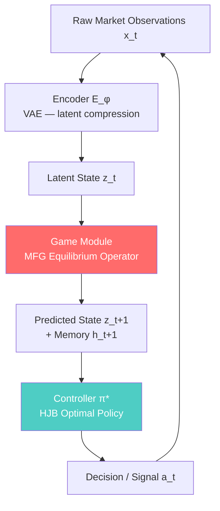
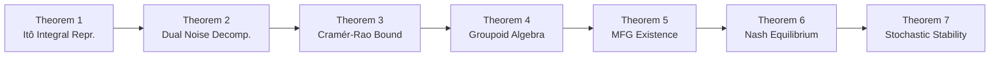

<div align="center">

# Mathematical Framework for World Models in Quantitative Finance

**What if markets had a world model? This paper answers that question with seven theorems and zero hand-waving.**

[](https://arxiv.org/)
[](LICENSE)
[]()
[]()

*Author: HongJin HE (何泓锦)*
*HKUST + Stanford IHP · July 2026 · Submitted to arXiv:q-fin.MF*

</div>

---

## What This Is

The V-M-C world model (Ha & Schmidhuber, 2018) changed how we think about learning in complex environments. But financial markets are not CartPole. They have:

- Multiple strategic agents interacting simultaneously (not a single agent vs. environment)
- Behavioral noise that is fundamentally different from physical/measurement noise
- Discontinuous events (earnings, central bank decisions) that aren't smooth state transitions
- Stationarity that is *induced* by agent competition, not assumed

**This paper builds the first complete mathematical theory adapting world models to these realities.**

The result is the **E-Game-C architecture** — replacing the RNN memory module in V-M-C with a Mean-Field Game equilibrium operator, grounded in seven original theorems.

---

## Architecture: E-Game-C



> The **Game** module (red) is the key innovation — it replaces a dumb RNN with a mean-field game equilibrium, capturing the fact that markets are the aggregate behavior of many strategic agents.

---

## Seven Theorems



| # | Theorem | Why It Matters |
|---|---------|---------------|
| **1** | Market dynamics = Itô *integral* equations (not differential) | Fixes the mathematical basis of most quant models |
| **2** | Noise decomposes uniquely: physical σ_τ + behavioral η (Lévy-Itô) | Separates what markets can't avoid from what agents choose |
| **3** | Prediction lower bound ≥ σ²_τ·h + λ_η·m²_η·h | Fundamental limit: no model can beat this, regardless of complexity |
| **4** | Financial events form a topological groupoid | Gives discontinuous events a coherent algebraic structure |
| **5** | E-Game-C MFG equilibrium exists (Schauder fixed point) | The architecture is mathematically well-posed |
| **6** | Hierarchical Nash equilibrium exists (Lasry-Lions monotonicity) | Multi-scale market structure is stable |
| **7** | Stochastic Lyapunov stability → unique stationary distribution | Markets have a well-defined long-run equilibrium |

---

## The Core Insight

```
Traditional approach:  dX_t = μ(X_t)dt + σ(X_t)dW_t          (SDE)

This paper:            X_t = X_0 + ∫μ(X_s)ds + ∫σ_τ(X_s)dW_s + ∫η(X_s)dL_s    (Itô integral)
                                                  ^^^physical^^^   ^^^behavioral^^^
```

The difference isn't pedantic — integral equations have fundamentally different regularity properties and admit solutions that SDEs don't. For financial modeling, this matters every time a market "jumps."

---

## Files

| File | Description |
|------|-------------|
| [`paper_draft_v1.pdf`](paper_draft_v1.pdf) | Full paper (25 pages) — start here |
| [`paper_draft_v1.tex`](paper_draft_v1.tex) | LaTeX source |
| [`mathematical_framework_overview.md`](mathematical_framework_overview.md) | Extended derivations |
| [`notebooks/`](notebooks/) | Numerical experiments |

---

## Who Should Read This

**You'll find this useful if you:**
- Work in model-based RL and want to understand why financial environments are hard
- Do quant research and want theoretical grounding for your world model intuitions
- Are interested in mean-field games but haven't seen them applied to market microstructure
- Want to understand why stationarity in financial markets is an *equilibrium outcome*, not an assumption

**Skip it if:**
- You want backtesting code (see [GFlowNet-Alpha-Mining](https://github.com/hongjin-he/GFlowNet-Alpha-Mining))
- You're allergic to measure theory (there's quite a bit of it)

---

## Citation

```bibtex
@article{he2026worldmodels,
  title   = {Mathematical Framework for World Models in Quantitative Finance},
  author  = {HongJin HE},
  year    = {2026},
  note    = {Preprint. arXiv:q-fin.MF (submitted)},
  url     = {https://github.com/hongjin-he/mathmatical-framework-for-world-models-in-quant-finance}
}
```

---

<div align="center">
<sub>HKUST × Stanford · MIT License · Theorems don't overfit to historical data</sub>
</div>
